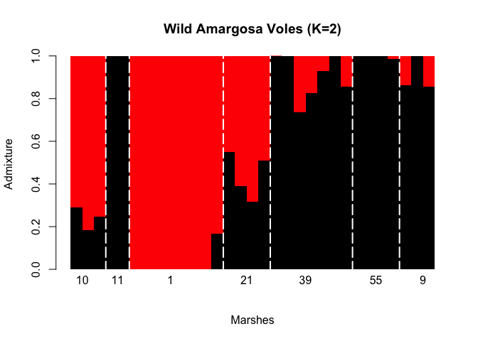
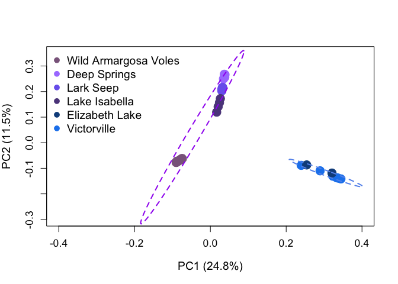

Using NGSadmix with ANGSD
================

This tutorial will lead you through, step by step, how to use R and ANGSD to make an NGSadmix plot for your data. We will also run 10 replicates of each K value so that you can use the Evanno et al. 2005 (doi: 10.1111/j.1365-294X.2005.02553.x) to determine the most likely K based on the log likelihood value of each K. This tutorial assumes that you have ANGSD and NGSadmix installed properly on your machine.

Generate Genotype Likelihoods from ANGSD
----------------------------------------

First, you need to generate the input data from ANGSD. You can also follow instructions from the [ANGSD website](http://www.popgen.dk/software/index.php/NgsAdmix). NGSadmix takes a [Beagle file](http://www.popgen.dk/angsd/index.php/Beagle_input), which you get from using the **-doGlf 2** flag in ANGSD.

Here's the code that I ran in bash to generate my beagle input file. Obviously, you'll have to change the filters and directories that you use, but these worked well for me. See the ANGSD website for details about the various flags and [filters](http://www.popgen.dk/angsd/index.php/Filters) that are possible.

``` bash
angsd -bam tecopa_bamlist_reduced -out ngsadmix_tecopa_only -sites ANGSD/keep_90percent.bed -anc genomes/kmer60-min500-scaffolds.fa -ref genomes/kmer60-min500-scaffolds.fa -only_proper_pairs 1 -minMapQ 2 -minQ 20 -doMajorMinor 1 -SNP_pval 1e-6 -doMaf 1 -doGlf 2 -GL 1 
```

Run NGSadmix 10 times per K value
---------------------------------

Second, input the beagle file into NGSadmix. This R code will run NGSadmix 10 times per K value (K = 1 through K = 8 here). This outputs a lot of files, so each one is named with the K value and the replicate (run). Again, you'll have to change the file names and filters. I had 31 individuals, so I only used sites that were present in ~70% of my individuals (**-minInd 21**). This can take a few hours depending on your computer, number of sites and number of K's.

``` r
for (j in 1:10) {
    for (i in 1:8) {
        system(paste("NGSadmix -likes ngsadmix_tecopa_only.beagle.gz -minMaf 0.05 -K ", 
            i, " -o ", "allindsK", i, "run", j, " -minInd 21", 
            sep = ""))
    }
}
```

Create the CLUMPAK Input File to Calculate the Best K
-----------------------------------------------------

Next, take the likelihood value from each run of NGSadmix and put them into a file that can be used with [Clumpak](http://clumpak.tau.ac.il/bestK.html) to calculate the most likely K using the methods of Evanno et al. (2005).

From the output directory of the above loops, create a file of all of the log likelihoods in bash:

``` bash
(for log in `ls *.log`; do grep -Po 'like=\K[^ ]+' $log; done) > logfile
```

Next, import that file with R and format it correctly for Clumpak. Start in the working directory that logfile exists in. You'll have to change the K column to reflect the number of K's that you used. We used 10 replicates of K, so this code works.

``` r
logs <- as.data.frame(read.table("logfile"))
logs$K <- c(rep("1", 10), rep("2", 10), rep("3", 10), rep("4", 
    10), rep("5", 10), rep("6", 10), rep("7", 10), rep("8", 10))
write.table(logs[, c(2, 1)], "logfile_formatted", row.names = F, 
    col.names = F, quote = F)
```

**Remember** that bash will store files that start with 10 before files that start with 1. So, if you have 12 K's you'll have to do:

``` r
logs$K <- c(rep("10", 10), rep("11", 10), rep("12", 10), rep("1", 10), rep("2", 
    10), rep("3", 10), rep("4", 10), rep("5", 10), rep("6", 10), 
    rep("7", 10), rep("8", 10), rep("9", 10))
```

The logfile\_formatted file can be used with [Clumpak](http://clumpak.tau.ac.il/bestK.html) to determine your most likely K.

Plot the Best K Value for Your Data
-----------------------------------

Next, we'll make a barplot of the admix values. The NGSadmix output makes customizing the plots very easy using R.

First, import the .qopt file from one of the runs of your most likely K. My most likely K was K = 2. As you can see for the first 10 individuals here, the .qopt file is just a matrix with one row for each individual, and one column for the percentage of admixture for each of the K's. We'll transpose that matrix to make a barplot easier.

``` r
admix <- t(as.matrix(read.table("/Users/AirAlex/Documents/Berkeley/VoleProject/bestrad2016/Analysis/aligned_radtools_noclones/k90_outputs/ngsAdmix/only_wild_tecopa/allindsK2run3.qopt")))
head(admix[, 1:10])
```

    ##         [,1]      [,2]      [,3]  [,4]  [,5]  [,6]  [,7]  [,8]  [,9] [,10]
    ## V1 0.2898925 0.1821966 0.2482021 1e+00 1e+00 1e-09 1e-09 1e-09 1e-09 1e-09
    ## V2 0.7101075 0.8178034 0.7517979 1e-09 1e-09 1e+00 1e+00 1e+00 1e+00 1e+00

Next, we need to make a vector that assigns each individual to a population. If you've taken this tutorial from the beginning, this will be in the same order as the list of BAM files that you gave to ANGSD. For me, my populations are designated by marsh number.

``` r
populations <- c(rep("10", 3), rep("11", 2), rep("1", 8), rep("21", 
    4), rep("39", 7), rep("55", 4), rep("9", 3))
```

Finally, make the barplot. I labelled the x-axis with the population labels (the **text()** command), and centered them using a vector of numbers such that each label comes out in approximately the middle of each group. I then added a white line between each group (the **abline()** command). Obviously, you'll have to change these numbers depending on the number of individuals in your groups.

``` r
barplot(admix, col = c("black", "red"), space = 0, border = NA, 
    ylab = "Admixture", xlab = "Marshes", main = "Wild Amargosa Voles (K=2)")
text(c(1, 4, 8.5, 15, 20, 26, 30), -0.05, unique(populations), 
    xpd = T)
abline(v = c(3, 5, 13, 17, 24, 28), lty = 5, lwd = 2, col = "white")
```



From here you can customize the plot in a variety of ways. For example, you can move the various barplot columns into an order that makes sense for you (maybe based on geography, or levels of admixture). I could write a silly function to do this, but it seems like the easiest way may just be to manipulate the original barplot with a bunch of vectors. Here I shift the marsh order to go from North to South, change the colors and increase the font size:

``` r
geolocated <- admix[, c(6:13, 1:3, 14:17, 18:24, 25:28, 29:31, 
    4:5)]
barplot(geolocated, col = c("black", "gray56"), space = 0, border = NA, 
    ylab = "Admixture", xlab = "Marshes", cex.axis = 1.5, cex.lab = 1.5)
abline(v = c(8, 11, 15, 22, 26, 29), lty = 5, lwd = 2, col = "white")
text(c(4, 9.5, 13, 18, 24, 27.7, 30.2), -0.05, c("1", "10", "21", 
    "55", "39", "9", "11"), xpd = T, cex = 1.2)
```


