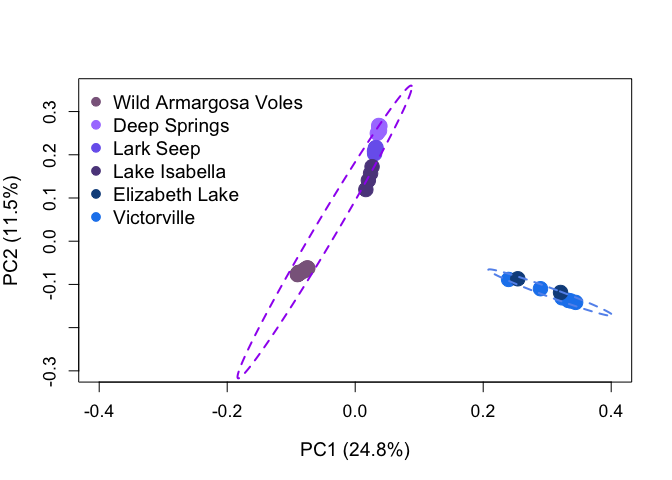

Principle Component Analyses Without Calling SNPs Using ngsCovar
================

This tutorial takes the output from ngsCovar (a covariance matrix), and makes a PCA plot customized to your liking. To get an output from ngsCovar see this tutorial [here](https://arundurvasula.wordpress.com/2015/02/08/pca-with-angsd-and-ngscovar/), and see the actual package [here](https://github.com/mfumagalli/ngsTools#ngscovar). As always, your filters will likely differ from those in the above tutorial.

My tutorial mainly modifies the plotting and PCA functions built in to ngsCovar to make the outputs more customizable in R. I'll use an example of a PCA done on desert dwelling California Voles (Figure 2 in citation), but the code is the same for Figure 3 (same citation).

Input the Covariance Matrix and Calculate Eigenvalues
-----------------------------------------------------

To begin, you must import your covariance matrix from ngsCovar. If you followed the above tutorial, you will have labeleled this \*.covar.

``` r
covar <- read.table("~/Documents/Berkeley/VoleProject/bestrad2016/Analysis/aligned_radtools_noclones/k90_outputs/pca/wild_plus_outgroups/wildtecopa_plusoutgroups_ngscovar_1Dec2016", 
    stringsAsFactors = FALSE)
```

Next use the eigen function to calculate eigenvalues and eigenvectors of the covariance matrix. This is directly from the ngsCovar script included in the ngsTools package.

``` r
eig <- eigen(covar, symm = TRUE)
eig$val <- eig$val/sum(eig$val)
```

You can also display the percent variation explained by the first four PC axes.

``` r
variation <- signif(eig$val, digits = 3) * 100
variation[1:4]
```

    ## [1] 24.80 11.50  4.29  3.87

Isolate the Eigenvectors
------------------------

We are interested in plotting in the eigenvectors for a typical PCA plot. The data are stored with each column representing one PC axis (a vector of eigenvectors, if you will), with each row corresponding to an individual. Here are the data for the first four PC axes again:

``` r
PC <- as.data.frame(eig$vectors)
PC[1:6, 1:4]
```

    ##            V1          V2           V3            V4
    ## 1 -0.08931749 -0.07531903 -0.011528904  1.644289e-04
    ## 2 -0.08003600 -0.06875923 -0.007564920 -7.817321e-05
    ## 3 -0.08557847 -0.07305104 -0.011081234  1.895004e-04
    ## 4 -0.07491958 -0.06175890 -0.008127171  1.789347e-04
    ## 5 -0.07700461 -0.06415032 -0.010006835 -1.503907e-04
    ## 6 -0.08941305 -0.07521255 -0.011639856  3.591356e-04

Make Population and Color Vectors
---------------------------------

For each row, you will next assign a population (for making a legend), and colors (for plotting) to each row. I added these on as columns in the PC data matrix, but that's not necessary if you don't want. The order of the colors and populations is the same order as the BAM files that you fed to ANGSD to make the covariance matrix. [Here's](https://www.google.com/url?sa=i&rct=j&q=&esrc=s&source=images&cd=&ved=0ahUKEwj5tJTdwdfTAhUC0mMKHfhZDngQjBwIBA&url=https%3A%2F%2Fgreggilbertlab.sites.ucsc.edu%2Fwp-content%2Fuploads%2Fsites%2F276%2F2015%2F10%2Fcolorbynames.png&psig=AFQjCNE-NPqX9ibiQt5LWyfXqxL58TiD9w&ust=1494031098762193) my favorite image with lots of names for R colors. The vectors from from my data:

``` r
PC$pop <- c(rep("Wild Amargosa Voles", 31), rep("Victorville", 6), rep("Deep Springs", 
    6), rep("Lark Seep", 5), rep("Lake Isabella", 4), rep("Elizabeth Lake", 2))
PC$color <- c(rep("plum4", 31), rep("dodgerblue2", 6), rep("mediumpurple1", 6), rep("slateblue2", 
    5), rep("mediumpurple4", 4), rep("dodgerblue4", 2))
```

Plot the PCA
------------

Make the plot!

``` r
plot(PC$V2 ~ PC$V1, col = PC$color, pch = 19, xlab = "PC1 (24.8%)", ylab = "PC2 (11.5%)", 
    cex.lab = 1.2, cex = 2, cex.axis = 1.1, xlim = c(-0.4, 0.4), ylim = c(-0.3, 0.35))
legend("topleft", col = unique(PC$color), legend = unique(PC$pop), pch = 19, cex = 1.2, 
    bty = "n")
```


Looks good, but I really want the legend colors to be in color order (with blues for the Southern Clade, and purples for the Northern Clade).

``` r
plot(PC$V2 ~ PC$V1, col = PC$color, pch = 19, xlab = "PC1 (24.8%)", ylab = "PC2 (11.5%)", 
    cex.lab = 1.2, cex = 2, cex.axis = 1.1, xlim = c(-0.4, 0.4), ylim = c(-0.3, 0.35))
legend("topleft", col = unique(PC$color)[c(1, 3:6, 2)], legend = c("Wild Armargosa Voles", 
    "Deep Springs", "Lark Seep", "Lake Isabella", "Elizabeth Lake", "Victorville"), 
    pch = 19, cex = 1.2, bty = "n")
```


Let's also add in ellipses to show the 95% confidence interval around these points. The groupings for the ellipses below come from the most likely K (K = 2 with these population groupings) from NGSadmix using the Evanno et al. (2005) methods (see [my other tutorial](https://github.com/alexkrohn/AmargosaVoleTutorials/blob/master/ngsAdmix_tutorial.md) for more information).

Define the groups for each ellipse:

``` r
northernclade <- PC[which(PC$pop == "Deep Springs" | PC$pop == "Lark Seep" | PC$pop == 
    "Lake Isabella" | PC$pop == "Wild Amargosa Voles"), ]
southernclade <- PC[which(PC$pop == "Elizabeth Lake" | PC$pop == "Victorville"), 
    ]
```

Load the required ellipse package, and then plot the ellipses on top of the old PCA plot:

``` r
library(ellipse)
plot(PC$V2 ~ PC$V1, col = PC$color, pch = 19, xlab = "PC1 (24.8%)", ylab = "PC2 (11.5%)", 
    cex.lab = 1.2, cex = 2, cex.axis = 1.1, xlim = c(-0.4, 0.4), ylim = c(-0.3, 0.35))
legend("topleft", col = unique(PC$color)[c(1, 3:6, 2)], legend = c("Wild Armargosa Voles", 
    "Deep Springs", "Lark Seep", "Lake Isabella", "Elizabeth Lake", "Victorville"), 
    pch = 19, cex = 1.2, bty = "n")
points(ellipse(cor(northernclade[, c(1, 2)]), scale = c(sd(northernclade$V1), sd(northernclade$V2)), 
    centre = c(mean(northernclade$V1), mean(northernclade$V2)), level = 0.95), type = "l", 
    lwd = 2, lty = 2, col = "purple")
points(ellipse(cor(southernclade[, c(1, 2)]), scale = c(sd(southernclade$V1), sd(southernclade$V2)), 
    centre = c(mean(southernclade$V1), mean(southernclade$V2)), level = 0.95), lty = 2, 
    type = "l", col = "cornflowerblue", lwd = 2)
```


